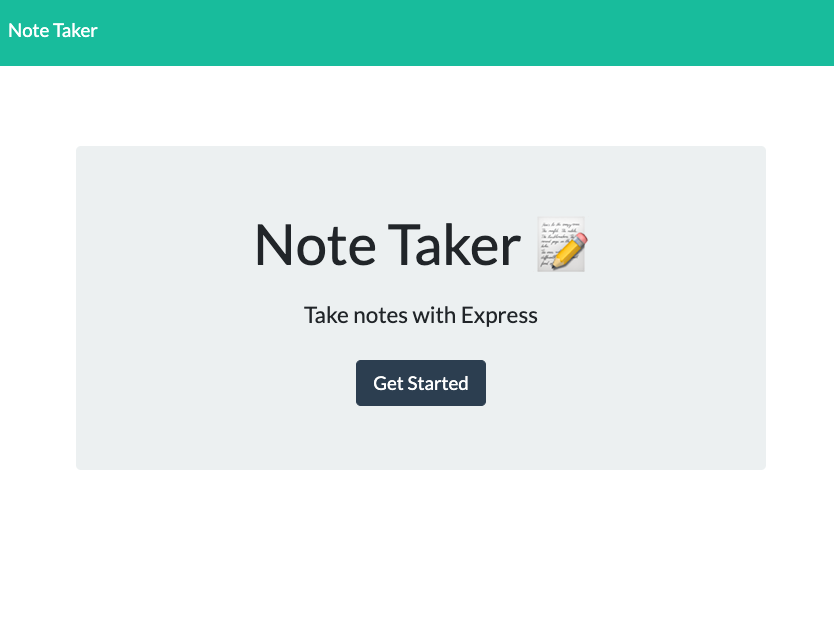
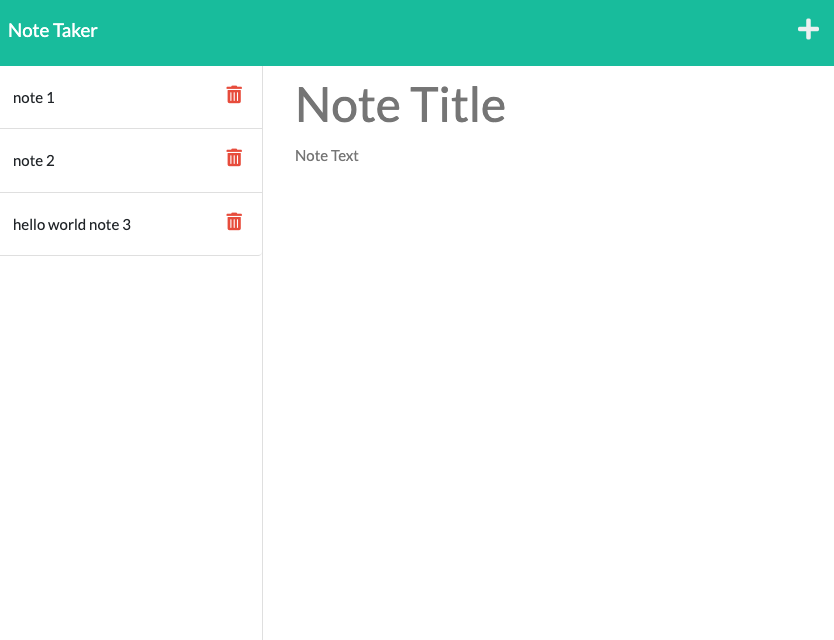

# Banana note taker

## Table of Contents
- [Description](#description)
- [Media](#media)
- [Scope](#scope-of-project)
- [Tools](#tools-used)
- [Install](#how-to-install)
- [Test](#how-to-test)

## Description
Note taker is a font end application that can be used to write notes , save notes , and delete notes.

## Media
### screenshots

### video 

## Scope of project
- Use Node.js , express.js, NPM, to be able to process the request of the front end application such as GET,POST, and DELETE and return the right data or execute the right functions to operate the application.

## Tools used
- NPM
    - Node.js
    - Express.js
    - FS
    - util
    - generate-unique-id
- Java Script
- HTML
- CSS

## How to install 
- run "npm install" in terminal to download the dependencies in order to run application

## How to test locally
- run "npm start" ( to start the server )
- navigate to 'http://localhost:3001/notes'
- take some notes and click the save button
- refresh the app to check for reload of notes
- delete note if needed

## How to test via heroku
- navigate to link
- https://banana-note.herokuapp.com/notes
